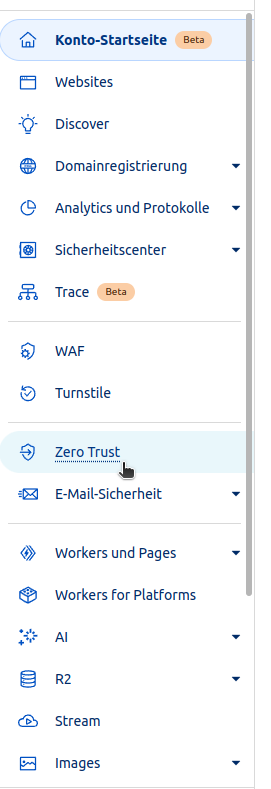
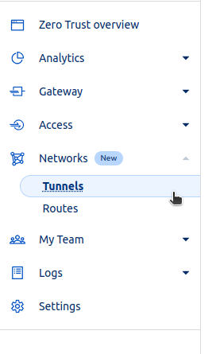
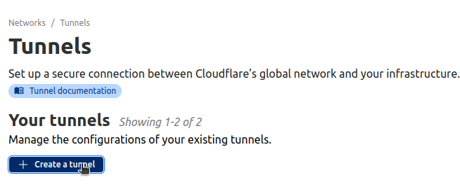
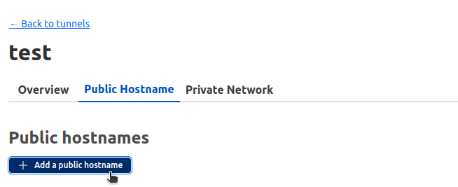
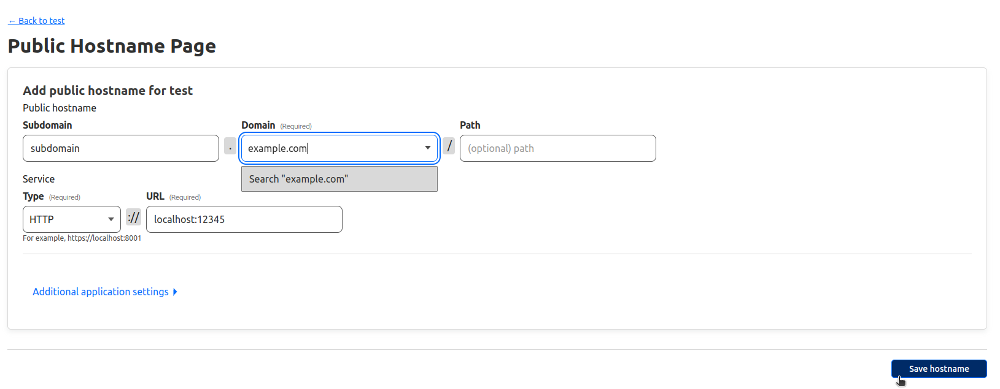

# Nextcloud docker with cloudflared
## container with preset smtp settings
#### start in detached mode and allow all domains

```bash
docker run -d \
  --name nextcloud \
  --restart unless-stopped \
  -p 7777:80 \
  -e NEXTCLOUD_TRUSTED_DOMAINS='*' \
  -e NEXTCLOUD_DEFAULT_LANGUAGE=de \
  -e NEXTCLOUD_ADMIN_USER=youradminusername \
  -e NEXTCLOUD_ADMIN_PASSWORD=youradminpassword \
  -e SMTP_HOST=<SMTP_HOST, eg smtp.provider.com> \
  -e SMTP_SECURE=ssl \
  -e SMTP_PORT=465 \
  -e SMTP_AUTHTYPE=LOGIN \
  -e SMTP_NAME=<email-username>@<your domain, eg. example.com>\
  -e SMTP_PASSWORD='<your password>' \
  -e MAIL_FROM_ADDRESS=<email-username> \
  -e MAIL_DOMAIN=<your domain, eg. example.com> \
  nextcloud
  ```

#### Optional: Allow all domains

```bash
docker exec -u $(docker exec nextcloud id -u www-data) -it nextcloud /var/www/html/occ config:system:set trusted_domains 1 --value='*'
```

#### Optional, if you cannot create files in nextcloud

```bash
docker exec -u $(docker exec nextcloud id -u www-data) -it nextcloud /bin/bash chown -R www-data:www-data /var/www/html
```
#### Optional: Expose installation through cloudflared

1.) In your logged in cloudflare account, navigate to "Zero Trust"



2.) Click on "Tunnels"



3.) "Create a tunnel"



4.) Select "Cloudflared", hit next

5.) Give your tunnel a meaningful name

6.) Copy and Paste the presented command

7.) Click on the tunnel and hit "Edit"

8.) Navigate to "Public Hostname" and add a public hostname



9.) Choose your domain and a subdomain, for example "subdomain.example.com". For apps that for example run on localhost:12345, enter "HTTP" for the "Type" and "localhost:12345" for the URL. 



10.) Now your application, that runs on your local machine on localhost:12345 is now accessible through subdomain.example.com, including a secure connection
